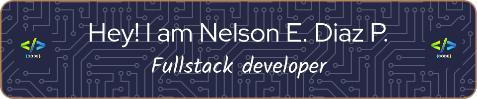
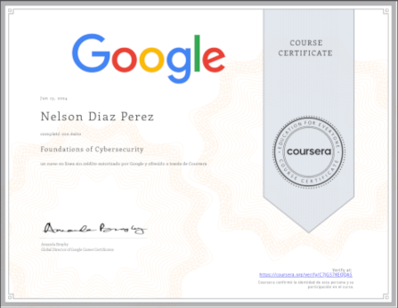

<h2>Soy un entusiasta de la computación y la informática, apasionado de la programación y del aprendizaje, 100% autodidacta.</h2>

<h2>I am a computer and IT enthusiast, passionate about programming and learning, 100% self-taught</h2>
<h3>👋🏿 💪🏿 👨‍💻</h3>

  

###  A little more about me...  

```javascript
const neslondiaze = {
  pronouns: "he" | "him",
  askjMeAbout:["Web dev", "tech", "game"],
  technologies:{
     frontEnd: ["HTML","JavaScript", "ReactJS", "Angular", "CSS", "Bootstrap"],
     backEnd: ["Java", "PHP", "NodeJS"],
     databases: ["MySql", "Mongo DB", "Sqlite3"],
     otherTechnologies: ["Docker", "Cobol", "Visual Basic"],
     misc: ["Firebase", "Socket.IO", "GNU/Linux"],
     cybersecurity: ["Foundations of  Cybersecurity"]
  }
};
```
### Skills


<p align="left">
<a href="https://developer.mozilla.org/en-US/docs/Web/JavaScript" target="_blank" rel="noreferrer"></a><a href="https://git-scm.com/" target="_blank" rel="noreferrer"></a><a href="https://www.python.org/" target="_blank" rel="noreferrer"></a><a href="https://www.typescriptlang.org/" target="_blank" rel="noreferrer"></a><a href="https://www.gnu.org/software/bash/" target="_blank" rel="noreferrer"></a><a href="https://code.visualstudio.com/" target="_blank" rel="noreferrer"></a><a href="https://www.vim.org/" target="_blank" rel="noreferrer"></a><a href="https://www.sublimetext.com/index2" target="_blank" rel="noreferrer"></a><a href="https://developer.mozilla.org/en-US/docs/Glossary/HTML5" target="_blank" rel="noreferrer"></a><a href="https://reactjs.org/" target="_blank" rel="noreferrer"></a><a href="https://vuejs.org/" target="_blank" rel="noreferrer"></a><a href="https://tailwindcss.com/" target="_blank" rel="noreferrer"></a><a href="https://getbootstrap.com/" target="_blank" rel="noreferrer"></a><a href="https://babeljs.io/" target="_blank" rel="noreferrer"></a><a href="https://vitejs.dev/" target="_blank" rel="noreferrer"></a><a href="https://www.w3.org/TR/CSS/#css" target="_blank" rel="noreferrer"></a><a href="https://nodejs.org/en/" target="_blank" rel="noreferrer"></a><a href="https://expressjs.com/" target="_blank" rel="noreferrer"></a><a href="https://fastapi.tiangolo.com/" target="_blank" rel="noreferrer"></a><a href="https://www.mongodb.com/" target="_blank" rel="noreferrer"></a><a href="https://www.mysql.com/" target="_blank" rel="noreferrer"></a><a href="https://www.postgresql.org/" target="_blank" rel="noreferrer"></a><a href="https://www.figma.com/" target="_blank" rel="noreferrer"></a><a href="https://wordpress.com" target="_blank" rel="noreferrer"></a><a href="https://www.linux.org" target="_blank" rel="noreferrer"></a><a href="https://www.docker.com/" target="_blank" rel="noreferrer"></a></p>

              
## Course


### Languages


---
### Other statistics


---


### Other Accounts 📫

You can find and get touch with me on these accounts!

| [](https://github.com/neslondiaze) | [](https://dev.to/neslondiaze)| [](https://www.deviantart.com/neslondiaze) | [](https://twitter.com/neslondiaze) | [](https://gitlab.com/neslondiaze) | [](https://www.reddit.com/user/neslondiaze)
|---|---|---|---|---|---|
  
  
  

---
⭐️ From [neslondiaze](https://github.com/neslondiaze)
